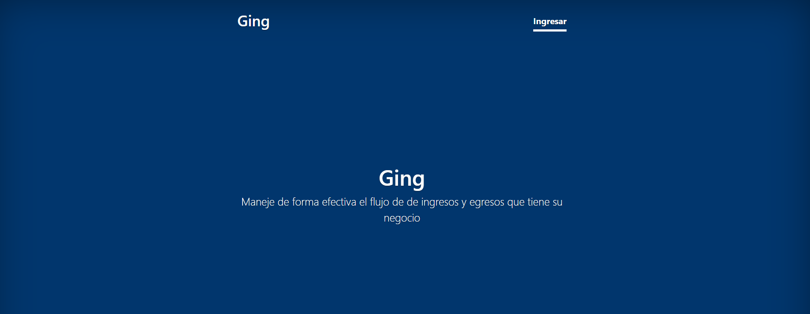

# Ging

Control de flujo de de ingresos y egresos para negocios

# Vista previa

<div align="center">
  
</div>

<div align="center">
  
</div>

# Instalación

Crear un ambiente virtual y activarlo

```python
pip install -r requirements.txt
```

# Configuración.

Crear una copia del archivo "settings.example.json" con el nombre "settings.json".

Configura el archivo con tu base de datos

    "DB": {
        "default": {
          "ENGINE": "django.db.backends.postgresql_psycopg2",
          "HOST": "localhost",
          "NAME": "djflow",
          "USER": "admin",
          "PASSWORD": "admin",
          "PORT": 5432
        }
      }

Y también sus credenciales de envío de correos electrónicos. 

    "EMAIL": {
        "EMAIL_USE_TLS": true,
        "EMAIL_HOST": "smtp.gmail.com",
        "EMAIL_PORT": 587,
        "EMAIL_BACKEND": "django.core.mail.backends.smtp.EmailBackend",
        "EMAIL_HOST_USER": "my-mail@gmail.com",
        "EMAIL_HOST_PASSWORD": "**************",
        "DEFAULT_FROM_EMAIL": "my-mail@gmail.com",
        "CONTACT_EMAIL": "my-mail@gmail.com"
      }

# Iniciando base de datos y proyecto y creamos un superusuario

```python
python manage.py migrate
python manage.py createsuperuser
```

Listo! Esto debe ser todo lo necesario para que tengan corriendo el proyecto en sus equipos locales: 

```python
python manage.py runserver
```

# Como contribuir

Enviame un pull request o contactame en mis redes sociales como eocode